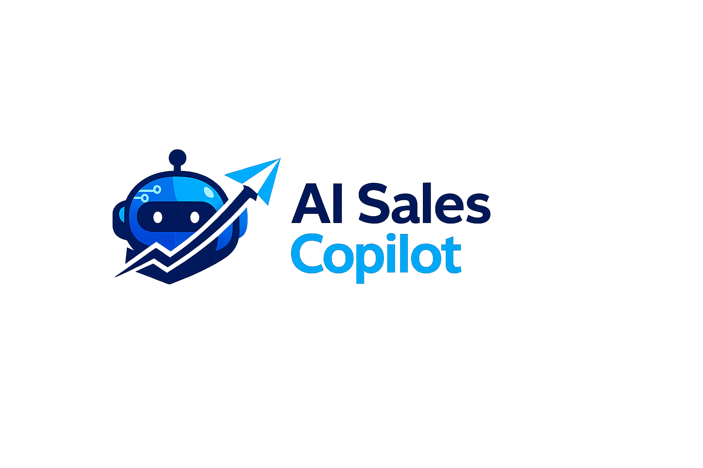
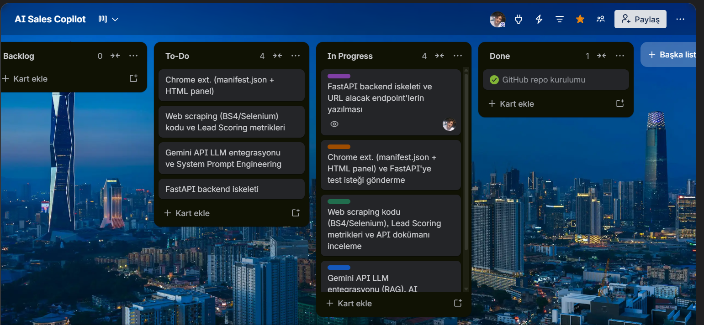

## **Takım İsmi**

**YZTA AI Innovators**

## **Takım Logosu**

[cite: 2]

## Takım Elemanları

|    | 
Name
   | 
Title
  | 
Socials
     |
| :-----------: | :---------- | :---------- | :----------: |
|    | Elifgül Topcu     | Product Owner     |     | 
|      | Hamza Kürşat Akburak     | Scrum Master     |   |
|    | Ahmet Bilal Özgün      | Developer      |     |
|      | Meryem Durdağı      | Developer     |       |

## Ürün İsmi

**AI Sales Copilot**

## Ürün Logosu

## Ürün Açıklaması

- **AI Sales Copilot**, B2B satış ekiplerinin müşteri araştırması ve kişiselleştirilmiş e-posta hazırlama süreçlerinde kaybettikleri vakti sıfıra indiren, otonom bir Chrome eklentisidir. Kullanıcı bir şirketin web sitesini ziyaret ettiğinde; eklentimiz arka planda çalışan yapay zeka ve veri bilimi algoritmalarıyla siteyi kazır, şirketin acı noktalarını (pain point) tespit eder ve o şirkete özel, AI dedektörlerine takılmayan mükemmel bir "cold email" taslağı sunar. 

## Proje Problemi ve Çözümü

- Satış ekipleri B2B müşteri araştırmasında ve o şirketin vizyonuna uygun, kişiselleştirilmiş e-posta hazırlamada çok vakit kaybetmektedir. Kopyala-yapıştır mailler ise anında reddedilmektedir. **AI Sales Copilot**, bu süreci saniyelere indiriyor. Kullanıcının arka planda girdiği kendi ürün bağlamını aklında tutarak (LLM RAG), hedef web sitesindeki verileri (Scraping) karşılaştırır. Bu sayede şirkete nokta atışı bir Lead Scoring (Müşteri Uyum Puanı) ve AI dedektörlerini atlatan insansı bir mail sunar.

## Ürün Özellikleri

- Chrome Extension tabanlı hızlı arayüz
- Web Scraping (BeautifulSoup/Selenium) ile anlık veri çekimi
- Gemini API ve RAG mimarisi ile bağlama duyarlı metin üretimi
- AI Detectors (Yapay Zeka Tespit) atlatma özellikli prompt mühendisliği
- Gelişmiş Lead Scoring (Potansiyel Müşteri Puanlama) altyapısı
- FastAPI tabanlı asenkron backend mimarisi

## Hedef Kitle

- B2B (İşletmeden İşletmeye) Satış Ekipleri
- SaaS (Hizmet Olarak Yazılım) Satış Temsilcileri
- İş Geliştirme Uzmanları ve Pazarlamacılar

## Pazarlama Planı

- Ürünümüzün "Demo" potansiyeli çok yüksek olduğundan, doğrudan hedef kitlemiz olan LinkedIn'deki satış liderlerine eklentinin yeteneklerini gösteren kısa videolarla ulaşmayı hedefliyoruz.[cite: 2]
- Başlangıçta kullanıcılara freemium (kısıtlı ücretsiz) model sunarak organik büyüme sağlanacak, sonrasında API ve token tüketimine bağlı olarak aylık abonelik (SaaS) sistemine geçilecektir.

## Product Backlog 

---

# Sprint 1

- **Sprint Notları**: Görevler Product Backlog'un içine yazılmıştır. Trello üzerindeki item'lara tıklandığında hikayelerin detayları okunabilmektedir.[cite: 2]

- **Sprint içinde tamamlanması tahmin edilen puan**: 100 Puan
- **Puan tamamlama mantığı**: Proje boyunca tamamlanması gereken toplam 300 puanlık backlog bulunmaktadır. 3 sprinte bölündüğünde ilk sprintin 100 ile başlaması gerektiği kararlaştırıldı.
- **Backlog düzeni ve Story seçimleri**: Backlog'umuz uygulamanın uçtan uca haberleşmesini sağlayacak temel MVP (Minimum Viable Product) mimarisinin kurulmasına odaklanmıştır. Sprint başına tahmin edilen puan sayısını geçmeyecek şekilde görevler dağıtılmıştır. Trello panomuzda mor etiketler _Backend_, turuncu etiketler _Frontend_, yeşil etiketler _Data Science_, pembe etiketler ise _AI / YZ_ görevlerini temsil etmektedir.

- **Daily Scrum**: Daily Scrum toplantılarının WhatsApp üzerinden yapılması kararlaştırılmıştır. Daily Scrum toplantılarımız Imgur'da toplanmıştır: [Sprint 1 - Daily Scrum Chats](https://imgur.com/a/daily-scrum-chats-1-V49yG8A)

- **Sprint board update**: Sprint board screenshot: 

- **Ürünün Durumu**:

  Projemizin mevcut ve planlanan geliştirme süreçleri sprint bazlı olarak aşağıda detaylandırılmıştır. İlk sprint başarıyla tamamlanmış olup, sonraki aşamalar tahmini hedefler doğrultusunda planlanmıştır:

  | Sprint | Durum | Ana Hedef | Kapsam | Tahmini Puan |
  | :---: | :---: | :--- | :--- | :---: |
  | **Sprint 1** | Tamamlandı | Çalışan MVP | Repository kurulumu, Temiz Mimari (Clean Architecture) tabanlı backend yapısı, FastAPI ile `/analyze` ve `/email` uç noktaları, BeautifulSoup ve Playwright entegrasyonu ile web kazıma çözümleri, Manifest V3 uyumlu Chrome eklentisi, Gemini entegrasyonu (özet, acı noktası ve sinyal tespiti), kural tabanlı potansiyel müşteri puanlaması (lead scoring) ve temel soğuk e-posta üretimi ile uçtan uca çalışan demo. | 100 |
  | **Sprint 2** | Planlanan (Gerçekleşmedi) | Zenginleştirme ve Sağlamlık | Soğuk e-posta ve pitch kalitesinin artırılması (few-shot öğrenme ve doğal dil tonu), çoklu dil modeli desteği (Claude ve sağlayıcıdan bağımsız fabrika yapısı), web kazıma kararlılığı (SSRF koruması, robots.txt kurallarına uyum, yeniden deneme mekanizmaları, istek sınırlama ve kullanıcı dostu hata mesajları), kullanıcı deneyimi (UX) geliştirmeleri ve birim testleri. | 90 |
  | **Sprint 3** | Planlanan (Gerçekleşmedi) | İleri Seviye Özellikler | RAG (Retrieval-Augmented Generation) ve vektör veri tabanı entegrasyonu, Apollo.io entegrasyonu ile veri zenginleştirme, çok sayfalı web kazıma, geçmişteki başarılı e-postalardan öğrenme yeteneği, önbellekleme mekanizmaları ve puanlama metriklerinin genişletilmesi. | 60 |
  | **Sprint 4** | Planlanan (Gerçekleşmedi) | Ürünleştirme ve Sunum | Bulut sunuculara dağıtım (deployment), basit kimlik doğrulama (auth) yapısı, loglama ve izleme sistemleri, performans ile güvenlik incelemeleri, kullanıcı testleri, demo videosunun hazırlanması ve jüri sunumu (demo mimarisi ile canlı ortam mimarisinin karşılaştırılması). | 50 |

- **Sprint Review**: 
  - (Sprint bitiminde 5 Temmuz'da doldurulacaktır: Ekip projede nelerin bittiğini ve gidişatı değerlendirdi.)
  - Sprint Review katılımcıları: Hamza Kürşat Akburak, Elifgül Topcu, Meryem Durdağı, Ahmet Bilal Özgün.

- **Sprint Retrospective:** 
  - (Sprint bitiminde 5 Temmuz'da doldurulacaktır: Hangi konularda hızlanmamız gerektiği ve sonraki sprint'in rotası tartışıldı.)

---

### Ürünün Durumu ve Tanıtım Görselleri

Uygulamanın çalışma akışını ve arayüzünü gösteren hareketli ekran görüntüleri (GIF) aşağıda yer almaktadır:

